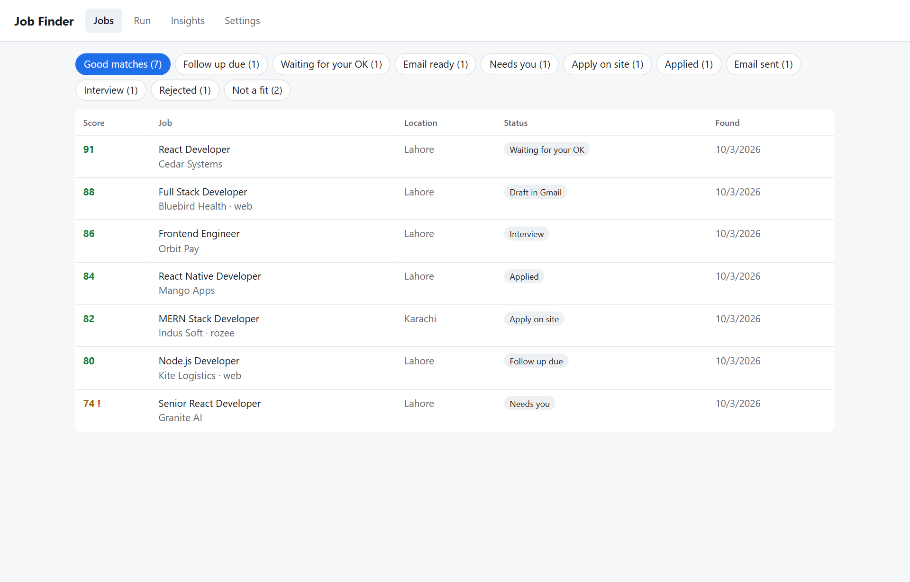
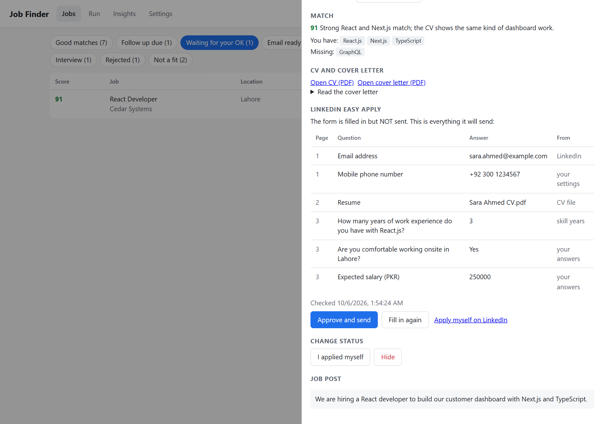
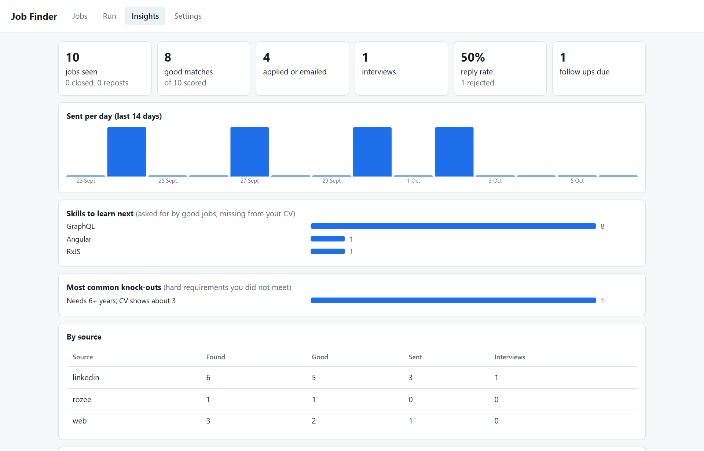
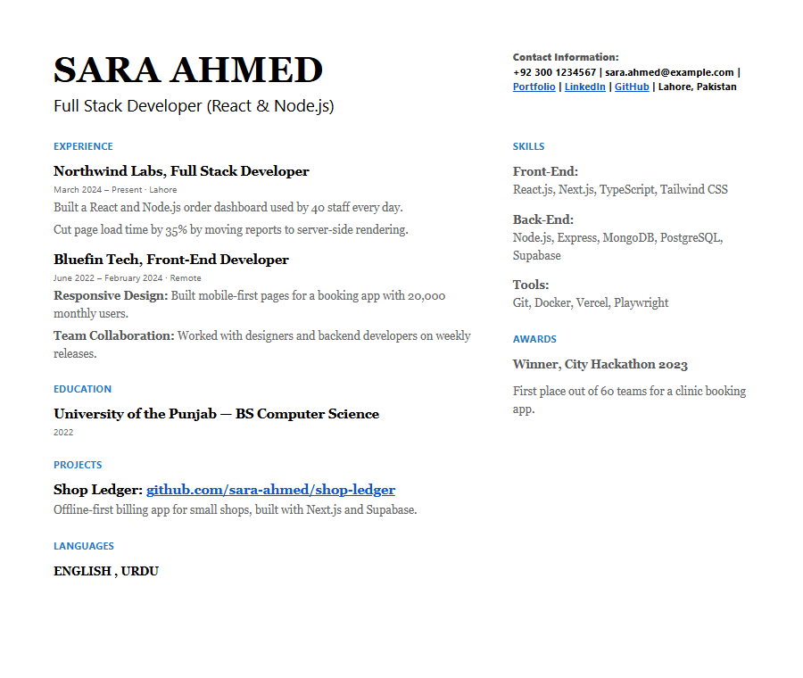

# Job Finder

A job search assistant that runs on your own computer. Every run it:

1. **Finds jobs** on LinkedIn and Rozee.pk (free), and optionally the wider web (a paid search).
2. **Scores each job** against your real CV: how well you fit, hard requirements you miss
   ("knock-outs"), and signs of a scam ("red flags").
3. **Writes a CV and a cover letter for each good match.** It only uses facts from your own CV.
4. **Prepares every application and waits for your OK. Nothing is sent on its own:**
   - **LinkedIn Easy Apply jobs:** it fills in the whole form, stops before Submit, and shows you every
     question and answer it would send. You press **Approve and send**, or apply yourself.
   - **Jobs that give an email:** the email with your CV attached is saved in your **Gmail Drafts**.
     You read it in Gmail, change it if you like, and press Send there.
   - **Other jobs** (Rozee, company websites) get a ready CV and the link, so you can apply yourself.
5. **Reads replies in your Gmail.** When a company answers, the job changes to Interview, Rejected
   or Offer by itself.
6. **Emails you a short summary** after each run: new good matches, replies, and what is waiting for you.
7. **Tracks the rest:** follow-up reminders, and an Insights page with your reply rate and the
   skills good jobs keep asking for.

It is careful not to get you rate limited or blocked (see "Rate limits" below).

It also includes **11 LinkedIn writing skills for Claude Code**: posts, comments, replies, profile
review, weekly plan and more. See [linkedin-skills/README.md](linkedin-skills/README.md).

Everything runs locally. Your CV, settings and job list stay on your computer. The only things that
leave it are: page visits to the job sites, your CV and job text going to Claude for scoring and
writing, and the applications and emails you allow.

## Screenshots

The screenshots use made-up jobs and a made-up person.

**Jobs.** Every job found, with its score and where it stands. The buttons at the top filter the list.



**Waiting for your OK.** The Easy Apply form is filled in but not sent. You see every question and
the answer it will give, the match score, and the CV and cover letter written for this job.



**Insights.** How many jobs it found, how many you applied to, your reply rate, the skills good jobs
keep asking for, and the hard requirements you missed most often.



**The CV it writes.** A new CV for each job, made only from facts in your own CV. Skills the job asks
for come first.



---

## What you need

| | why | get it |
|---|---|---|
| **Node.js 22 or newer** | runs the program | https://nodejs.org |
| **Claude Code**, logged in | scores jobs and writes CVs (no API key needed) | https://claude.com/claude-code, then run `claude` once and log in |
| **Google Chrome** | the browser it drives | https://www.google.com/chrome (or see "No Chrome" below) |
| A **Gmail** account with an app password | only if you want to send emails | see step 5 |
| **Python 3** | only for the `/li-human` writing skill | https://www.python.org |

Claude usage is billed to the Claude account you log in with. See "Cost" below.

## Setup (about 20 minutes, once)

Open a terminal in this folder, then:

**1. Install**

```
npm install
```

**2. Copy the example files**

Windows (PowerShell):
```
Copy-Item .env.example .env
Copy-Item config\profile.example.json config\profile.json
Copy-Item profile\master-cv.example.md profile\master-cv.md
```
Mac / Linux:
```
cp .env.example .env && cp config/profile.example.json config/profile.json && cp profile/master-cv.example.md profile/master-cv.md
```

**3. Write your real CV** in `profile/master-cv.md`. Put in everything true: every job, project,
skill, number and certificate. The tailored CVs can only use what is written here, so more detail
gives better CVs. Delete the "REPLACE ME" lines at the top.

**4. Fill in your settings** in `config/profile.json`:

- `me`: your name, email, phone, city, LinkedIn and GitHub links.
- `search.keywords`: the job titles to search for. `search.locations`: for example `["Pakistan"]` or `["Lahore"]`.
- `match.what_i_want`, `must_have`, `deal_breakers`: what you want and what you will not accept.
- `answers.years_of_experience` and `answers.skill_years`: your real years with each skill. Easy Apply
  forms ask these, and the answers come from here.
- `answers.questions`: answers for other common form questions (see "Easy Apply questions" below).
- `apply`: `linkedin_auto` (automatic Easy Apply, **off** to start with), `auto_min_score`, `max_per_day`
  (5 to start with), `follow_up_days`.
- `notify`: `check_replies` (read replies in your inbox after each run) and `summary_email` (email yourself
  a summary). Both need step 5.

You can also edit these later in the dashboard's **Settings** tab.

**5. (Optional, recommended) Email.** Turn on 2-step verification in your Google account, create an
[app password](https://myaccount.google.com/apppasswords), and put it in `.env`:
```
SMTP_USER=your.address@gmail.com
SMTP_PASS=the 16-letter app password
```
The same login is used for three things: sending applications when you press Send, reading replies
(read-only: nothing in your mailbox is changed or marked read), and the summary email to yourself.
For a non-Gmail account also set `SMTP_HOST`, `SMTP_PORT`, `IMAP_HOST` and `IMAP_PORT`.

**6. (Optional) LinkedIn login, needed for Easy Apply.**
```
npm run login
```
A browser window opens. Log in to LinkedIn yourself, then close the window. The login is saved in
`data/browser-profile/`. Your password is never stored by this program.

**7. (Optional) LinkedIn writing skills**
```
npm run install-skills
```
To see what they make, `npm run examples:linkedin` saves a sample text post and a 10-slide carousel
(PNG + PDF) to `data/linkedin-examples/`, under your own name: the LinkedIn account you logged in with,
else `me.name` in `config/profile.json`. Nothing is posted.

**8. Check everything**
```
npm run doctor
```
It lists anything still missing and how to fix it. `npm run doctor -- --claude --linkedin --email`
also makes one tiny Claude call (about $0.01), opens LinkedIn with your login, and logs in to your
email. Nothing is sent.

## First run

```
npm run start -- --limit 5
```

This finds up to 5 new jobs, scores them, writes CVs and cover letters, fills in the Easy Apply forms
of the good LinkedIn matches (**without pressing Submit**), and puts the email applications into your
Gmail Drafts. Nothing is sent. Then open the dashboard:

```
npm run ui
```
Open http://localhost:3100 and go to **Waiting for your OK**. For each job you see the score, the CV,
the cover letter, and a table of every question and the answer it would send. Then:

- **Approve and send**: the form is filled in again and sent, but **only if it gives exactly the
  answers you saw**. If LinkedIn changed the form in the meantime (a new question, a different
  answer), nothing is sent and you see the new version to approve.
- **Fill in again**: after you changed your answers in Settings.
- **Apply myself on LinkedIn**: opens the job.

For email jobs, open Gmail's Drafts, check each draft and press Send. The dashboard notices on its
next run that it was sent and starts the follow-up reminder.

(Automatic applying without asking still exists for people who want it: `"linkedin_auto": true` in
`config/profile.json`. It is off by default, and we suggest leaving it off.)

## Everyday use

```
npm run ui                          # the dashboard: Jobs, Run, Insights, Settings
npm run start                       # a full run from the terminal
npm run start -- --limit 10         # at most 10 new jobs this run
npm run start -- --no-apply         # find, score and make CVs, but do not fill in Easy Apply forms
npm run start -- --no-web           # skip the paid web search
npm run start -- --no-notify        # do not read the inbox or send the summary email
npm run replies                     # check the inbox for replies now
```

In the dashboard, click any job to see the score and reasons, open the CV and cover letter, approve
an Easy Apply form, save the email to Gmail Drafts (or send it from the dashboard), check whether the
job is still open, write a follow-up, or mark it Interview / Offer / Rejected.

### Run it every morning (optional)

Windows (PowerShell), with the path changed to where this folder is:
```
schtasks /Create /SC DAILY /ST 09:00 /TN "Job Finder" /TR "cmd /c cd /d C:\path\to\job-finder && npm run start >> logs\daily.log 2>&1"
```
Remove it with `schtasks /Delete /TN "Job Finder" /F`. Everything it prepares still waits for your OK.

## Job statuses

| status | meaning |
|---|---|
| Waiting for your OK | Easy Apply form filled in, **not sent**; check the answers and approve |
| Check and apply | good LinkedIn match, form not filled in yet (the next run does it) |
| Draft in Gmail | the email and CV are in your Gmail Drafts; send it from Gmail |
| Email ready | email is ready in the dashboard (add the To address, or set up email) |
| Needs you | Easy Apply stopped on a question it had no answer for (shown on the job) |
| Will auto apply | only with `linkedin_auto` on: strong match with no warnings, sent without asking |
| Apply on site | apply on the website yourself; the CV is ready |
| Applied / Email sent | done. After `follow_up_days` with no reply it shows under **Follow up due** |
| Interview / Offer / Rejected | you set these; used for the reply rate |
| Closed | the job no longer takes applications |
| Repost | same company and title as a job already seen; not applied to twice |
| Not a fit | scored below `match.min_score` |

A red **!** next to a score means a knock-out, a red flag or a possible ghost job.

## Easy Apply questions

Easy Apply fills in only what it knows: your contact details, your CV file, the cover letter, and
your answers in `config/profile.json`. Yes/No questions such as "Do you have 5+ years of React?" are
answered from `skill_years`. If your real answer is No, it answers No.

If a required question has no answer, it **does not guess**. It closes the form without sending and
marks the job **Needs you**, showing the question. Add an answer under `answers.questions`, for example:
```json
{ "match": "security clearance", "answer": "No" }
```
`match` is a regular expression matched against the question text, ignoring upper and lower case.
Then press **Fill in again** on the job.

## Safety rules

- **The CV never makes things up.** After Claude writes a tailored CV, the program removes any
  employer, job title, school, project, certificate, language or skill that is not in your
  `master-cv.md`, and any number that is not in it. The email and cover letter can only use numbers
  from your CV, or the job post's own numbers with the same word ("3+ years"). Every removal is listed on the job.
- **Nothing is sent without your OK.** Easy Apply forms are filled in and stopped before Submit;
  you approve the exact answers. Approving sends only if the form still gives those exact answers.
- **Easy Apply never guesses** (see above), and unticks "follow company".
- **Emails go to your Gmail Drafts, not out.** You send them from Gmail. The dashboard's "Send from
  here instead" button sends only after a confirm box. Email addresses come only from the job post or
  from what you type, never from the AI.
- **Before anything is sent** the job page is checked again. If it looks closed you are asked first.
- If you switch on `linkedin_auto`: never for jobs with a knock-out, a red flag, a possible ghost job,
  or a role you already applied to; at most `apply.max_per_day` a day, 30 to 60 seconds apart.
- **Separate browsers.** Searching uses a logged-out browser. Your LinkedIn login is used only for Easy Apply.
- **Your inbox is read-only.** Only emails that look like they are about a job you applied to are
  opened and sent to Claude to classify. Others are never opened.
- The dashboard only accepts requests from your own computer.

**Please read:** automated applying is against LinkedIn's user agreement, and LinkedIn can restrict
accounts that do it. That is why everything waits for your OK by default.

## Rate limits

Job sites block programs that read too fast. Every page load goes through one guard
(`src/lib/throttle.ts`) that keeps you well below that:

| site | gap between page loads | most pages per day |
|---|---|---|
| LinkedIn (search, job pages, Easy Apply, all together) | 8 to 16 seconds | 150 |
| Rozee.pk | 10 to 20 seconds | 80 |
| other job sites | 4 to 9 seconds | 200 |

- **If a site still says "too many requests" or shows a bot check** ("Just a moment..."), the run stops
  reading that site at once and rests it: 30 minutes the first time, then 1 hour, 2 hours and so on,
  up to 24 hours, or longer if the site asks. The rest is saved in `data/rate-limits.json`, so the next
  runs and the dashboard buttons leave the site alone too. It never tries to get around a block.
- **LinkedIn's own daily Easy Apply limit:** when LinkedIn says you reached it, Easy Apply stops until
  8am the next day.
- **Claude limits:** a short "too many requests" is waited out (1 minute, then 2.5 minutes) and tried
  again. If your Claude plan's usage limit is reached, the run stops, and the remaining jobs are
  scored next run. Nothing is lost.
- The Run tab shows each site's pages today and any rest. To go slower everywhere, set `SLOWDOWN=2`
  in `.env` (twice the gaps).

## What is tested

`npm test` runs 60 checks. It needs no internet and makes no real Claude calls:

- **Truthfulness:** invented skills, employers, schools and numbers are removed from CVs, emails and cover letters.
- **Easy Apply, in a real browser, against a local copy of the form:** filling in shows every answer
  (including what LinkedIn filled itself) and sends nothing; approving sends exactly those answers (CV
  uploaded, cover letter typed, "follow company" unticked); if the form changed in between, nothing is
  sent; an unknown question stops without sending; "already applied" and external-only jobs are
  recognised; a job goes Check and apply → Waiting for your OK → Applied.
- **Gmail drafts:** the draft has the right To, subject, signature and CV attachment, goes in once, and
  a draft you sent from Gmail is noticed in Sent.
- **Page reading:** saved copies of real LinkedIn and Rozee pages (`test/fixtures`) are parsed.
  Closed jobs and passed closing dates are detected.
- **The whole pipeline with a fake Claude:** score, then CV, cover letter and email, then PDFs, then
  status. This includes the automatic retry when Claude returns a bad format.
- **The dashboard in a real browser:** lists, filters, job drawer, follow-ups, status changes,
  Insights, refusing bad settings, and refusing requests from other websites.
- **Email:** the exact message that would be sent (recipient, subject, signature, attachment).
- **Replies:** emails are matched to the right application (and unrelated mail is never opened);
  interview, rejection and offer replies change the job; nothing is read twice.
- **Summary email:** goes to your own address only, lists what is new and waiting, and is not sent when nothing changed.
- **Rate limits:** gaps between loads, the daily budget, longer rests after repeated blocks,
  Retry-After, rests that survive a restart and are shared between the dashboard and a run, and
  Claude's short limits (retried) versus usage limits (stop).
- **The LinkedIn skills:** all 11 are well formed, and the humanizer scripts run.

`npm run test:live` checks the same things against the **real** LinkedIn and Rozee sites, slowly.
`LIVE_CLAUDE=1 npm run test:live` also scores and tailors one real job with the real model (about $0.10).
On PowerShell: `$env:LIVE_CLAUDE=1; npm run test:live`. Run it when something stops working: the
sites change their pages from time to time. `npm run fixtures:capture` refreshes the saved pages.

**What cannot be tested without your own accounts:**
- **Easy Apply on the real, logged-in LinkedIn site.** The form logic is tested against a local copy
  built from LinkedIn's markup, but LinkedIn's real form can differ or change. Because every form is
  shown to you before anything is sent, you see the result first. If it stops with "no Next / Review /
  Submit button" or "the form did not move forward", LinkedIn changed the form: the job is marked
  Needs you, nothing is sent, and you can apply by hand.
- **Your real Gmail.** Drafts, Sent and reading replies are tested with stand-ins. `npm run doctor -- --email`
  checks that sending and reading both log in, without sending or saving anything.

## Cost

Searching, reading pages and the open-or-closed checks are free. Claude calls (measured October 2026, Sonnet model):

| step | cost |
|---|---|
| score one job (fit, knock-outs, red flags) | about $0.03 to $0.10 |
| CV, cover letter and email for a good match | about $0.05 to $0.10 |
| classify one reply in your inbox | about $0.01 to $0.03 |
| one web search query (`search.web_queries`) | about $0.12 |

A run of 20 new jobs usually costs $1 to $2.5. Set `MATCH_MODEL=haiku` in `.env` to make
scoring cheaper (less consistent scores).

## Troubleshooting

| problem | fix |
|---|---|
| `npm run doctor` says something to fix | follow its arrow line |
| "browser does not open" / no Chrome | install Chrome, or set `BROWSER_CHANNEL=chromium` in `.env` and run `npx playwright install chromium` |
| "Claude Code was not found" | install Claude Code and run `claude` once to log in |
| "... is limiting automated reading. Resting it until ..." | nothing to do: it waits by itself. If it happens often, set `SLOWDOWN=2` in `.env` |
| "Claude is limiting requests" | your Claude plan's limit; the next run continues where this one stopped |
| "Could not check your inbox" | check `SMTP_USER` / `SMTP_PASS`; run `npm run doctor -- --email` |
| "Not logged in to LinkedIn" | `npm run login` again |
| Easy Apply often ends in "Needs you" | add answers under `answers.questions` |
| Email login failed | Gmail needs an app password, not your normal password |
| Port 3100 in use | set `UI_PORT=3200` in `.env` |

## Files

```
config/profile.json      your settings            (private, never committed)
profile/master-cv.md     your real CV             (private, never committed)
.env                     your email login, options (private, never committed)
data/                    jobs found, CVs made, LinkedIn login (private)
logs/                    one log file per run (counts and errors only)
prompts/                 the instructions Claude gets for scoring and writing
linkedin-skills/         the 11 LinkedIn writing skills
```

Built with Playwright, Claude Code (`claude -p`) and zod. Some ideas (open-or-closed check,
knock-outs, ghost jobs, follow-ups, rejection patterns) come from
[career-ops](https://github.com/career-ops-hq/career-ops). The LinkedIn skills are from
[linkedin-agent-skill](https://github.com/Jakeschincariol/linkedin-agent-skill) (MIT).
